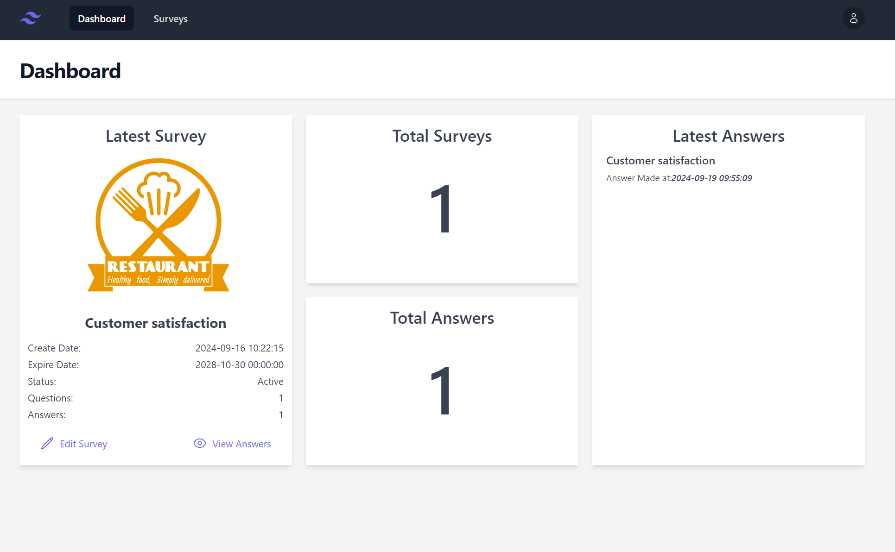

<a id="readme-top"></a>

<!-- PROJECT SHIELDS -->
[![Contributors][contributors-shield]][contributors-url]
[![Forks][forks-shield]][forks-url]
[![Stargazers][stars-shield]][stars-url]
[![Issues][issues-shield]][issues-url]
[![MIT License][license-shield]][license-url]
[![LinkedIn][linkedin-shield]][linkedin-url]


<!-- PROJECT LOGO -->
<br />
<div align="center">
  <a href="https://github.com/NgYiKai/survey-laravel">
    
  </a>

<h3 align="center">Survey</h3>

  <p align="center">
    Survey is an innovative platform designed to create, publish, and manage surveys seamlessly. Whether you need to collect feedback, conduct market research, or gauge customer satisfaction, this project offers a streamlined solution to distribute surveys to your target audience.
    <br />
    <a href="https://github.com/NgYiKai/survey-laravel"><strong>Explore the docs »</strong></a>
    <br />
    <br />
    <a href="https://github.com/NgYiKai/survey-laravel">View Demo</a>
    ·
    <a href="https://github.com/NgYiKai/survey-laravel/issues/new?labels=bug&template=bug-report---.md">Report Bug</a>
    ·
    <a href="https://github.com/NgYiKai/survey-laravel/issues/new?labels=enhancement&template=feature-request---.md">Request Feature</a>
  </p>
</div>


<!-- TABLE OF CONTENTS -->
<details open>
  <summary>Table of Contents</summary>
  <ol>
    <li>
      <a href="#about-the-project">About The Project</a>
      <ul>
        <li><a href="#built-with">Built With</a></li>
      </ul>
    </li>
    <li>
      <a href="#getting-started">Getting Started</a>
      <ul>
        <li><a href="#prerequisites">Prerequisites</a></li>
        <li><a href="#getting-started-with-docker">Getting Started with Docker</li>
        <li><a href="#getting-started-without-docker">Getting Started without Docker</a></li>
      </ul>
    </li>
    <li><a href="#usage">Usage</a></li>
    <li><a href="#roadmap">Roadmap</a></li>
    <li><a href="#contributing">Contributing</a></li>
    <li><a href="#license">License</a></li>
    <li><a href="#contact">Contact</a></li>
  </ol>
</details>


<!-- ABOUT THE PROJECT -->
## About The Project

### Key features

* Easy Survey Creation: Intuitive interface for building custom surveys with various question types.

* Survey Publishing: Publish surveys and share them via public or private links.

* Real-time Response Tracking: Monitor survey results as they come in with instant updates.

<p align="right">(<a href="#readme-top">back to top</a>)</p>


### Built With

* [![React][React.js]][React-url]
* [![Laravel][Laravel.com]][Laravel-url]

<p align="right">(<a href="#readme-top">back to top</a>)</p>


<!-- GETTING STARTED -->
## Getting Started

This is an example of how you may give instructions on setting up your project locally.
To get a local copy up and running follow these simple example steps.

### Prerequisites

This is an example of how to list things you need to use the software and how to install them.
* npm
  ```sh
  npm install npm@latest -g
  ```
* Docker(Optional)
  
If you prefer using Docker, ensure Docker is installed and running on your machine. You can download it from Docker's official website.

### Getting Started with Docker

1. Clone the repo
   ```sh
   git clone https://github.com/NgYiKai/survey-laravel.git
   ```

2. Navigate to the project director and copy the ```.env.example``` file to create your .env file
   
   ```js
    cp .env.example .env
   ```

3. Run docker compose
   ```
   docker compose up
   ```

4. Open a shell session inside container

   Replace laravel_app with the actual name of your Docker container, if different
   
   ```
   docker exec -it laravel_app sh
   ```
   
5. Generate the application key inside container

   ```sh
   php artisan key:generate
   ```

6. Run the database migrations inside container
   
    ```
    php artisan migrate
    ```

7. Install dependencies for frontend

   Navigate to the ```/react``` directory and install the required dependencies via npm

   ```
   npm install
   ```

8. Set up your environment variables

   Copy the ```.env.example``` file to create your .env file
   
   ```js
    cp .env.example .env
   ```
   Update the ```.env``` file,  the ```VITE_API_BASE_URL=``` should point to your server

9. Start the development server
    ```
    npm run dev
    ```
    
### Getting Started without Docker

1. Clone the repo
   ```sh
   git clone https://github.com/NgYiKai/survey-laravel.git
   ```
2. Install dependencies for backend

   Navigate to the project directory and install the required PHP dependencies via Composer
   ```sh
    composer install
   ```
3. Set up your environment variables

   Copy the ```.env.example``` file to create your .env file
   
   ```js
    cp .env.example .env
   ```
   Update the ```.env``` file with your specific settings, especially your database credentials
   
4. Generate the application key
   ```sh
   php artisan key:generate
   ```

5. Run the database migrations
    ```
    php artisan migrate
    ```
    
6. Start the development server
    ```
    php artisan serve    
    ```

7. Install dependencies for frontend

   Navigate to the ```/react``` directory and install the required dependencies via npm

   ```
   npm install
   ```

8. Set up your environment variables

   Copy the ```.env.example``` file to create your .env file
   
   ```js
    cp .env.example .env
   ```
   Update the ```.env``` file,  the ```VITE_API_BASE_URL=``` should point to your server

9. Start the development server
    ```
    npm run dev
    ```

<p align="right">(<a href="#readme-top">back to top</a>)</p>


<!-- USAGE EXAMPLES -->
## Usage

Use this space to show useful examples of how a project can be used. Additional screenshots, code examples and demos work well in this space. You may also link to more resources.

_For more examples, please refer to the [Documentation](https://example.com)_

<p align="right">(<a href="#readme-top">back to top</a>)</p>


<!-- ROADMAP -->
## Roadmap

- [ ] Improve server side logging
- [ ] Improve client side error handling
- [ ] Implement view answer page


See the [open issues](https://github.com/NgYiKai/survey-laravel/issues) for a full list of proposed features (and known issues).

<p align="right">(<a href="#readme-top">back to top</a>)</p>


<!-- CONTRIBUTING -->
## Contributing

Contributions are what make the open source community such an amazing place to learn, inspire, and create. Any contributions you make are **greatly appreciated**.

If you have a suggestion that would make this better, please fork the repo and create a pull request. You can also simply open an issue with the tag "enhancement".
Don't forget to give the project a star! Thanks again!

1. Fork the Project
2. Create your Feature Branch (`git checkout -b feature/AmazingFeature`)
3. Commit your Changes (`git commit -m 'Add some AmazingFeature'`)
4. Push to the Branch (`git push origin feature/AmazingFeature`)
5. Open a Pull Request

<p align="right">(<a href="#readme-top">back to top</a>)</p>

### Top contributors:

<a href="https://github.com/NgYiKai/survey-laravel/graphs/contributors">
  
</a>


<!-- LICENSE -->
## License

Distributed under the MIT License. See `LICENSE.txt` for more information.

<p align="right">(<a href="#readme-top">back to top</a>)</p>


<!-- CONTACT -->
## Contact

Ng Yi Kai - ykng0508@gmail.com

Project Link: [https://github.com/NgYiKai/survey-laravel](https://github.com/NgYiKai/survey-laravel)

<p align="right">(<a href="#readme-top">back to top</a>)</p>


<!-- MARKDOWN LINKS & IMAGES -->
<!-- https://www.markdownguide.org/basic-syntax/#reference-style-links -->
[contributors-shield]: https://img.shields.io/github/contributors/NgYiKai/survey-laravel.svg?style=for-the-badge
[contributors-url]: https://github.com/NgYiKai/survey-laravel/graphs/contributors
[forks-shield]: https://img.shields.io/github/forks/NgYiKai/survey-laravel.svg?style=for-the-badge
[forks-url]: https://github.com/NgYiKai/survey-laravel/network/members
[stars-shield]: https://img.shields.io/github/stars/NgYiKai/survey-laravel.svg?style=for-the-badge
[stars-url]: https://github.com/NgYiKai/survey-laravel/stargazers
[issues-shield]: https://img.shields.io/github/issues/NgYiKai/survey-laravel.svg?style=for-the-badge
[issues-url]: https://github.com/NgYiKai/survey-laravel/issues
[license-shield]: https://img.shields.io/github/license/NgYiKai/survey-laravel.svg?style=for-the-badge
[license-url]: https://github.com/NgYiKai/survey-laravel/blob/master/LICENSE.txt
[linkedin-shield]: https://img.shields.io/badge/-LinkedIn-black.svg?style=for-the-badge&logo=linkedin&colorB=555
[linkedin-url]: https://linkedin.com/in/linkedin_username
[product-screenshot]: images/screenshot.png
[Next.js]: https://img.shields.io/badge/next.js-000000?style=for-the-badge&logo=nextdotjs&logoColor=white
[Next-url]: https://nextjs.org/
[React.js]: https://img.shields.io/badge/React-20232A?style=for-the-badge&logo=react&logoColor=61DAFB
[React-url]: https://reactjs.org/
[Vue.js]: https://img.shields.io/badge/Vue.js-35495E?style=for-the-badge&logo=vuedotjs&logoColor=4FC08D
[Vue-url]: https://vuejs.org/
[Angular.io]: https://img.shields.io/badge/Angular-DD0031?style=for-the-badge&logo=angular&logoColor=white
[Angular-url]: https://angular.io/
[Svelte.dev]: https://img.shields.io/badge/Svelte-4A4A55?style=for-the-badge&logo=svelte&logoColor=FF3E00
[Svelte-url]: https://svelte.dev/
[Laravel.com]: https://img.shields.io/badge/Laravel-FF2D20?style=for-the-badge&logo=laravel&logoColor=white
[Laravel-url]: https://laravel.com
[Bootstrap.com]: https://img.shields.io/badge/Bootstrap-563D7C?style=for-the-badge&logo=bootstrap&logoColor=white
[Bootstrap-url]: https://getbootstrap.com
[JQuery.com]: https://img.shields.io/badge/jQuery-0769AD?style=for-the-badge&logo=jquery&logoColor=white
[JQuery-url]: https://jquery.com 
